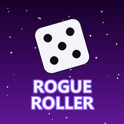
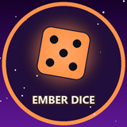
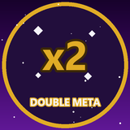

## Rogue Roller

<a class="aa-tile" href="rogue-roller/basics/" style="--ring: #22c55e"><strong>The basics</strong>How a run works, from your first roll to save and quit, meta points, ascension and Stardust.</a>
<a class="aa-tile" href="rogue-roller/formulas/" style="--ring: #8b5cf6"><strong>How the numbers work</strong>The exact sums for the meta a run pays and the Stardust an ascension pays.</a>
<a class="aa-tile" href="rogue-roller/shop-upgrades/" style="--ring: #3b82f6"><strong>Shop upgrades</strong>Every card the shop can deal, with prices.</a>
<a class="aa-tile" href="rogue-roller/gate-perks/" style="--ring: #8b5cf6"><strong>Gate perks and Spark</strong>The free cards you pick at every biome gate.</a>
<a class="aa-tile" href="rogue-roller/meta-tree/" style="--ring: #3b82f6"><strong>Meta tree</strong>Permanent upgrades, costs and ascension branches.</a>
<a class="aa-tile" href="rogue-roller/ascension-perks/" style="--ring: #ec4899"><strong>Ascension perks</strong>Spend Stardust to unlock rarer gate perks and start every run with them.</a>
<a class="aa-tile" href="rogue-roller/forge/" style="--ring: #eab308"><strong>Forge</strong>Crates, drop chances and every die face effect.</a>
<a class="aa-tile" href="rogue-roller/daily-challenges/" style="--ring: #22c55e"><strong>Daily challenges</strong>Today's challenge and streak rewards.</a>
<a class="aa-tile" href="rogue-roller/badges/" style="--ring: #f97316"><strong>Badges</strong>All the badges and how to earn them.</a>
<a class="aa-tile" href="rogue-roller/cosmetics/" style="--ring: #f97316"><strong>Cosmetics</strong>Dice and ball skins, and where to get them.</a>
<a class="aa-tile" href="rogue-roller/store/" style="--ring: #eab308"><strong>Store</strong>Passes, packs and what Premium gives you.</a>
<a class="aa-tile" href="rogue-roller/biomes/" style="--ring: #14b8a6"><strong>Biomes</strong>Every biome, its look, weather, creatures and sounds, and how long each one is.</a>

## Community

<a class="aa-tile" href="https://discord.gg/dQrpnsb2r9" style="--ring: #5865f2"><strong>Discord</strong>Chat, updates, events and help from other players.</a>
<a class="aa-tile" href="suggest-a-change/" style="--ring: #22c55e"><strong>Suggest a change</strong>Spotted a mistake? Tell us and a moderator will check it.</a>

