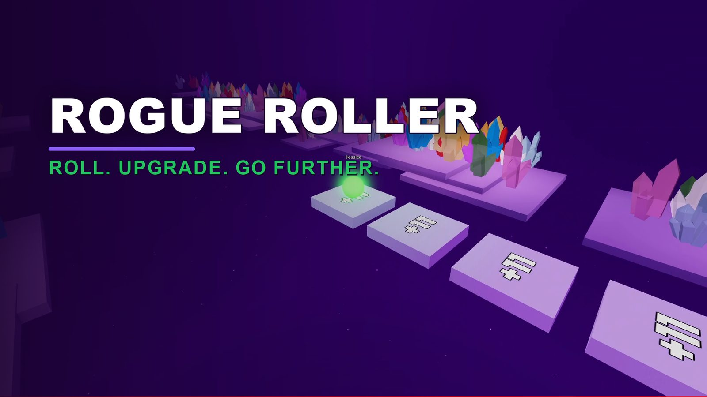

# Rogue Roller

Roll the die, hop that many tiles, and pick how your fuel comes back. Every run you buy upgrades with points, pick perks at biome gates, and turn your score into meta points that make the next run go further.

[Play Rogue Roller on Roblox](https://www.roblox.com/games/87428815126728){ .md-button .md-button--primary }
[Join the Discord](https://discord.gg/dQrpnsb2r9){ .md-button }

Rogue Roller is based on [RollScape](https://store.steampowered.com/app/2904290/RollScape/).

## Where to start

<a class="aa-tile" href="basics/" style="--ring: #22c55e"><strong>The basics</strong>How a run works, biomes, the shop, Spark and meta points.</a>
<a class="aa-tile" href="shop-upgrades/" style="--ring: #3b82f6"><strong>Shop upgrades</strong>Every card the shop can deal, with prices.</a>
<a class="aa-tile" href="gate-perks/" style="--ring: #8b5cf6"><strong>Gate perks and Spark</strong>The free cards you pick at biome gates.</a>
<a class="aa-tile" href="meta-tree/" style="--ring: #3b82f6"><strong>Meta tree</strong>Permanent upgrades, costs and ascension nodes.</a>
<a class="aa-tile" href="forge/" style="--ring: #eab308"><strong>Forge</strong>Crates, drop chances and every die face effect.</a>
<a class="aa-tile" href="daily-challenges/" style="--ring: #22c55e"><strong>Daily challenges</strong>Today's challenge and streak rewards.</a>
<a class="aa-tile" href="badges/" style="--ring: #f97316"><strong>Badges</strong>All the badges and how to earn them.</a>
<a class="aa-tile" href="cosmetics/" style="--ring: #f97316"><strong>Cosmetics</strong>Dice and ball skins, and where to get them.</a>
<a class="aa-tile" href="store/" style="--ring: #eab308"><strong>Store</strong>Passes, packs and what Premium gives you.</a>
<a class="aa-tile" href="biomes/" style="--ring: #14b8a6"><strong>Biomes</strong>The six biomes and how long each one is.</a>

Most pages are built straight from the game's own settings, so the numbers match the version shown at the bottom of each page.
