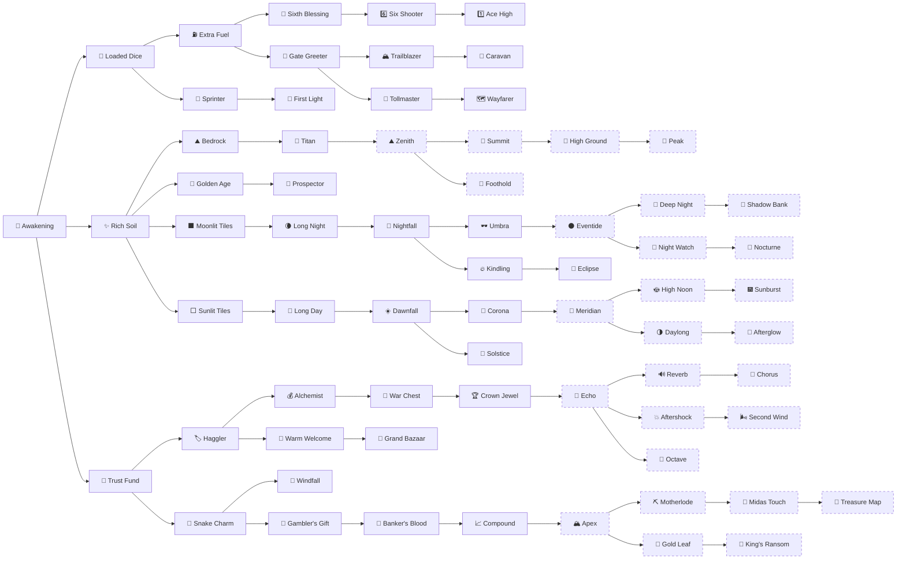

<!-- Generated by RogueRoller/tools/gen_wiki.py from Config.lua. Edits here are overwritten. -->

# Meta tree

41nodes in the base tree

72levels to buy

4,268meta for the whole tree

27ascension nodes

Meta points buy permanent upgrades that help every run. Each node needs the node before it, starting from Awakening.

- The tree only shows nodes up to 3 steps from what you own, so there is more to find as it grows.
- Buying, respecs and ascending wait while a run is live or [saved](basics.md#save-and-quit), because they would change that run.
- You get one free respec every 24 hours, which refunds what you spent. After that, a Meta Tree Respec from the [store](store.md) works whenever you have no run going or saved, and the Free Respec pass or Roblox Premium removes the wait.

## The whole tree

Dashed nodes unlock with [ascension](basics.md#ascension).

## Base tree

Card colours show which branch of the tree a node sits on.

<strong>Awakening</strong>
The first node1 level

Unlock the upgrade tree.

<small>Lv 1</small><b>1</b>

<strong>Loaded Dice</strong>
Needs Awakening3 levels

Start every run with +1 on every side of your die, per level.

<small>Lv 1</small><b>17</b><small>Lv 2</small><b>19</b><small>Lv 3</small><b>31</b><small>Total</small><b>67</b>

<strong>Extra Fuel</strong>
Needs Loaded Dice5 levels

Start every run with +10 rolls, per level.

<small>Lv 1</small><b>18</b><small>Lv 2</small><b>25</b><small>Lv 3</small><b>38</b><small>Lv 4</small><b>57</b><small>Lv 5</small><b>86</b><small>Total</small><b>224</b>

<strong>Sixth Blessing</strong>
Needs Extra Fuel1 level

Start every run with Sixth Sense: a natural 6 refunds the roll, or part of it on a die weighted toward 6.

<small>Lv 1</small><b>34</b>

<strong>Six Shooter</strong>
Needs Sixth Blessing3 levels

Start every run with +1 on the 6 side of your die, per level.

<small>Lv 1</small><b>58</b><small>Lv 2</small><b>94</b><small>Lv 3</small><b>150</b><small>Total</small><b>302</b>

<strong>Ace High</strong>
Needs Six Shooter3 levels

Start every run with +1 on the 1 side of your die, per level.

<small>Lv 1</small><b>110</b><small>Lv 2</small><b>175</b><small>Lv 3</small><b>275</b><small>Total</small><b>560</b>

<strong>Gate Greeter</strong>
Needs Extra Fuel3 levels

Every biome gate gives 7 more rolls, per level. Gates give fewer rolls if your die averages over 10.75 tiles.

<small>Lv 1</small><b>31</b><small>Lv 2</small><b>51</b><small>Lv 3</small><b>82</b><small>Total</small><b>164</b>

<strong>Trailblazer</strong>
Needs Gate Greeter1 level

Start every run with Momentum: every biome you enter gives all tiles +1 for the rest of the run.

<small>Lv 1</small><b>56</b>

<strong>Caravan</strong>
Needs Trailblazer1 level

Adds a second Momentum: every biome you enter gives all tiles +1 more.

<small>Lv 1</small><b>98</b>

<strong>Tollmaster</strong>
Needs Gate Greeter1 level

Start every run with Gate Bonus (+400 points per gate).

<small>Lv 1</small><b>61</b>

<strong>Wayfarer</strong>
Needs Tollmaster1 level

Every biome gate pays 800 points instead of 400.

<small>Lv 1</small><b>105</b>

<strong>Sprinter</strong>
Needs Loaded Dice1 level

Start every run with Head Start (the first tile of every roll pays double).

<small>Lv 1</small><b>21</b>

<strong>First Light</strong>
Needs Sprinter1 level

The first tile of every roll pays 2.5x instead of 2x.

<small>Lv 1</small><b>36</b>

<strong>Rich Soil</strong>
Needs Awakening3 levels

Every tile is worth +1 from the start, per level.

<small>Lv 1</small><b>17</b><small>Lv 2</small><b>21</b><small>Lv 3</small><b>36</b><small>Total</small><b>74</b>

<strong>Bedrock</strong>
Needs Rich Soil3 levels

Every tile is worth +1 more from the start, per level.

<small>Lv 1</small><b>24</b><small>Lv 2</small><b>40</b><small>Lv 3</small><b>64</b><small>Total</small><b>128</b>

<strong>Titan</strong>
Needs Bedrock1 level

Every tile is worth +2 from the start.

<small>Lv 1</small><b>40</b>

<strong>Golden Age</strong>
Needs Rich Soil1 level

Start every run with Golden Tiles (every 10th pays +10).

<small>Lv 1</small><b>22</b>

<strong>Prospector</strong>
Needs Golden Age1 level

Start every run with Golden Rush (golden tiles arrive 2 sooner).

<small>Lv 1</small><b>38</b>

<strong>Moonlit Tiles</strong>
Needs Rich Soil3 levels

Dark tiles are worth +1 from the start, per level.

<small>Lv 1</small><b>18</b><small>Lv 2</small><b>29</b><small>Lv 3</small><b>46</b><small>Total</small><b>93</b>

<strong>Long Night</strong>
Needs Moonlit Tiles1 level

Dark tiles are worth +2 more from the start.

<small>Lv 1</small><b>31</b>

<strong>Nightfall</strong>
Needs Long Night1 level

Start every run with Dark Landing: land on a dark tile and that roll pays +50%.

<small>Lv 1</small><b>53</b>

<strong>Umbra</strong>
Needs Nightfall1 level

Land on a dark tile and that roll pays +75% instead of +50%.

<small>Lv 1</small><b>100</b>

<strong>Kindling</strong>
Needs Nightfall1 level

Start every run with Dark Combo: each dark landing in a row after the first pays +25% more, up to +125%, or +200% with Nocturne.

<small>Lv 1</small><b>94</b>

<strong>Eclipse</strong>
Needs Kindling1 level

Start every run with Dark Jackpot (land on a dark tile: +50% on top of that roll).

<small>Lv 1</small><b>160</b>

<strong>Sunlit Tiles</strong>
Needs Rich Soil3 levels

Light tiles are worth +1 from the start, per level.

<small>Lv 1</small><b>18</b><small>Lv 2</small><b>29</b><small>Lv 3</small><b>46</b><small>Total</small><b>93</b>

<strong>Long Day</strong>
Needs Sunlit Tiles1 level

Light tiles are worth +2 more from the start.

<small>Lv 1</small><b>31</b>

<strong>Dawnfall</strong>
Needs Long Day1 level

Start every run with Light Landing: land on a light tile and that roll pays +50%.

<small>Lv 1</small><b>53</b>

<strong>Corona</strong>
Needs Dawnfall1 level

Land on a light tile and that roll pays +75% instead of +50%.

<small>Lv 1</small><b>100</b>

<strong>Solstice</strong>
Needs Dawnfall1 level

Start every run with Light Jackpot (land on a light tile: +50% on top of that roll).

<small>Lv 1</small><b>98</b>

<strong>Trust Fund</strong>
Needs Awakening5 levels

Start every run with +30 points, per level.

<small>Lv 1</small><b>17</b><small>Lv 2</small><b>19</b><small>Lv 3</small><b>21</b><small>Lv 4</small><b>31</b><small>Lv 5</small><b>46</b><small>Total</small><b>134</b>

<strong>Haggler</strong>
Needs Trust Fund3 levels

Upgrade cards cost 10% less, per level. Refreshes and new shops stay full price.

<small>Lv 1</small><b>18</b><small>Lv 2</small><b>31</b><small>Lv 3</small><b>53</b><small>Total</small><b>102</b>

<strong>Alchemist</strong>
Needs Haggler4 levels

Earn +25% meta points from runs, per level.

<small>Lv 1</small><b>29</b><small>Lv 2</small><b>48</b><small>Lv 3</small><b>78</b><small>Lv 4</small><b>125</b><small>Total</small><b>280</b>

<strong>War Chest</strong>
Needs Alchemist3 levels

Start every run with +150 points, per level.

<small>Lv 1</small><b>64</b><small>Lv 2</small><b>100</b><small>Lv 3</small><b>160</b><small>Total</small><b>324</b>

<strong>Crown Jewel</strong>
Needs War Chest1 level

Start every run with All Points +25% (your tiles pay 25% more).

<small>Lv 1</small><b>120</b>

<strong>Warm Welcome</strong>
Needs Haggler1 level

Start every run at the ADVANCED shop.

<small>Lv 1</small><b>36</b>

<strong>Grand Bazaar</strong>
Needs Warm Welcome1 level

Start every run at the ELITE shop.

<small>Lv 1</small><b>69</b>

<strong>Snake Charm</strong>
Needs Trust Fund1 level

Start every run with Snake Eyes (+150 on a natural 1).

<small>Lv 1</small><b>20</b>

<strong>Windfall</strong>
Needs Snake Charm1 level

Another +150 on a natural 1, on top of Snake Eyes.

<small>Lv 1</small><b>34</b>

<strong>Gambler's Gift</strong>
Needs Snake Charm1 level

Start every run with Double Down (15% chance a roll's points are doubled).

<small>Lv 1</small><b>36</b>

<strong>Banker's Blood</strong>
Needs Gambler's Gift1 level

Start every run with one Interest copy: 2% of your points a roll, up to a quarter of the roll.

<small>Lv 1</small><b>66</b>

<strong>Compound</strong>
Needs Banker's Blood1 level

A second Interest copy: 4% of your points a roll, up to 37.5% of the roll. More copies raise both.

<small>Lv 1</small><b>110</b>

## Ascension nodes

Every ascension opens a branch: the ascension's first node, then more nodes hanging off it, including abilities that change how a run plays. Each branch opens after that many ascensions and must be finished before the next ascension.

### Ascension 1

<strong>Echo</strong>
Ascension 1Needs Crown Jewel5 levels

Bedrock again: every tile is worth +1 more from the start, per level.

<small>Lv 1</small><b>800</b><small>Lv 2</small><b>950</b><small>Lv 3</small><b>1,100</b><small>Lv 4</small><b>1,250</b><small>Lv 5</small><b>1,450</b><small>Total</small><b>5,550</b>

<strong>Reverb</strong>
Ascension 1Needs Echo2 levels

The first tile of every roll pays +0.5x more, per level.

<small>Lv 1</small><b>1,200</b><small>Lv 2</small><b>1,550</b><small>Total</small><b>2,750</b>

<strong>Aftershock</strong>
Ascension 1Needs Echo3 levels

Every biome gate pays +400 more points, per level.

<small>Lv 1</small><b>950</b><small>Lv 2</small><b>1,200</b><small>Lv 3</small><b>1,450</b><small>Total</small><b>3,600</b>

<strong>Octave</strong>
Ascension 1Needs Echo1 level

Your second copy of every shop card except Refuel costs the same as the first, and every copy after it is one step cheaper.

<small>Lv 1</small><b>3,150</b>

<strong>Second Wind</strong>
Ascension 1Needs Aftershock1 level

The first roll after every biome gate pays 3x.

<small>Lv 1</small><b>2,800</b>

<strong>Chorus</strong>
Ascension 1Needs Reverb1 level

Every face of your die with a forge effect makes every roll pay +3% more, up to +18%.

<small>Lv 1</small><b>2,800</b>

### Ascension 2

<strong>Zenith</strong>
Ascension 2Needs Titan4 levels

Every tile is worth +2 more from the start, per level.

<small>Lv 1</small><b>700</b><small>Lv 2</small><b>850</b><small>Lv 3</small><b>1,000</b><small>Lv 4</small><b>1,100</b><small>Total</small><b>3,650</b>

<strong>Summit</strong>
Ascension 2Needs Zenith1 level

Adds another Momentum: every biome you enter gives all tiles +1 more.

<small>Lv 1</small><b>1,750</b>

<strong>Foothold</strong>
Ascension 2Needs Zenith3 levels

Start every run with +500 points, per level.

<small>Lv 1</small><b>600</b><small>Lv 2</small><b>750</b><small>Lv 3</small><b>950</b><small>Total</small><b>2,300</b>

<strong>High Ground</strong>
Ascension 2Needs Summit1 level

A roll that moves 6 or more tiles pays 1.5x.

<small>Lv 1</small><b>2,500</b>

<strong>Peak</strong>
Ascension 2Needs High Ground1 level

No roll pays less than 10% of your best roll in the biome you are in, not counting Second Wind or Treasure Map.

<small>Lv 1</small><b>3,150</b>

### Ascension 3

<strong>Eventide</strong>
Ascension 3Needs Umbra4 levels

Dark tiles are worth +2 more from the start, per level.

<small>Lv 1</small><b>600</b><small>Lv 2</small><b>700</b><small>Lv 3</small><b>850</b><small>Lv 4</small><b>950</b><small>Total</small><b>3,100</b>

<strong>Deep Night</strong>
Ascension 3Needs Eventide1 level

Dark Landing pays +25% more on top of its copies.

<small>Lv 1</small><b>1,800</b>

<strong>Night Watch</strong>
Ascension 3Needs Eventide2 levels

Another +300 on a natural 1, per level.

<small>Lv 1</small><b>600</b><small>Lv 2</small><b>800</b><small>Total</small><b>1,400</b>

<strong>Shadow Bank</strong>
Ascension 3Needs Deep Night1 level

Every dark landing also puts 10% of its points in a bank. The bank pays out double at the next biome gate.

<small>Lv 1</small><b>2,400</b>

<strong>Nocturne</strong>
Ascension 3Needs Night Watch1 level

Dark Combo keeps climbing past 5 landings in a row, up to 8.

<small>Lv 1</small><b>2,100</b>

### Ascension 4

<strong>Meridian</strong>
Ascension 4Needs Corona4 levels

Light tiles are worth +2 more from the start, per level.

<small>Lv 1</small><b>600</b><small>Lv 2</small><b>700</b><small>Lv 3</small><b>850</b><small>Lv 4</small><b>950</b><small>Total</small><b>3,100</b>

<strong>High Noon</strong>
Ascension 4Needs Meridian1 level

Light Landing pays +25% more on top of its copies.

<small>Lv 1</small><b>1,800</b>

<strong>Daylong</strong>
Ascension 4Needs Meridian3 levels

Light and dark tiles are each worth +1 more from the start, per level.

<small>Lv 1</small><b>650</b><small>Lv 2</small><b>850</b><small>Lv 3</small><b>1,050</b><small>Total</small><b>2,550</b>

<strong>Sunburst</strong>
Ascension 4Needs High Noon1 level

Your third light landing in a row, and every one after it, pays 2x. Does nothing while every tile is one colour.

<small>Lv 1</small><b>2,400</b>

<strong>Afterglow</strong>
Ascension 4Needs Daylong1 level

After a light landing, every tile on your next roll is worth +5.

<small>Lv 1</small><b>2,100</b>

### Ascension 5

<strong>Apex</strong>
Ascension 5Needs Compound4 levels

Golden tiles pay +20 more, per level.

<small>Lv 1</small><b>450</b><small>Lv 2</small><b>500</b><small>Lv 3</small><b>600</b><small>Lv 4</small><b>650</b><small>Total</small><b>2,200</b>

<strong>Motherlode</strong>
Ascension 5Needs Apex1 level

Golden tiles arrive 2 tiles sooner, like another Golden Rush. Golden Rush and Motherlode never space them closer than every 4th tile.

<small>Lv 1</small><b>1,500</b>

<strong>Gold Leaf</strong>
Ascension 5Needs Apex3 levels

Golden tiles pay +10 more, per level.

<small>Lv 1</small><b>500</b><small>Lv 2</small><b>650</b><small>Lv 3</small><b>750</b><small>Total</small><b>1,900</b>

<strong>Midas Touch</strong>
Ascension 5Needs Motherlode1 level

Land on a golden tile from the regular pattern and the next 5 tiles turn golden too. Tiles Midas Touch or Philosopher's Stone made golden do not set it off.

<small>Lv 1</small><b>1,900</b>

<strong>King's Ransom</strong>
Ascension 5Needs Gold Leaf1 level

Every golden tile you land on makes the rest of the run pay +2% more, up to +50%.

<small>Lv 1</small><b>1,900</b>

<strong>Treasure Map</strong>
Ascension 5Needs Midas Touch1 level

The first golden tile you land on in each biome pays 10x.

<small>Lv 1</small><b>1,700</b>

Numbers on this page match Rogue Roller version 2.4.0.

