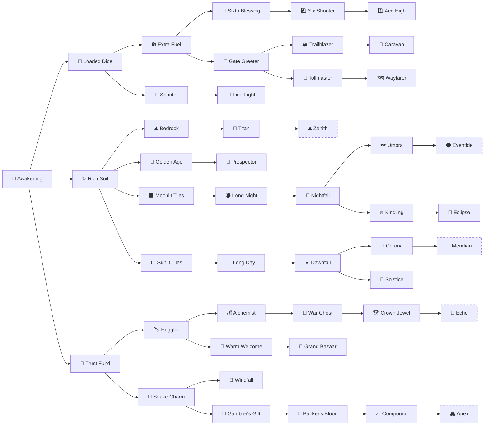

<!-- Generated by RogueRoller/tools/gen_wiki.py from Config.lua. Edits here are overwritten. -->

# Meta tree

Meta points buy permanent upgrades that help every run. Each node needs the node before it, starting from Awakening.

- The base tree has **41 nodes** with 72 levels, and costs **4,268 meta** in all.
- The tree only shows nodes up to 3 steps from what you own, so there is more to find as it grows.
- You get one free respec every 24 hours, which refunds what you spent. After that, a Meta Tree Respec from the [store](store.md) works any time, and the Free Respec pass or Roblox Premium removes the wait.

## The whole tree

Dashed nodes unlock with [ascension](basics.md#ascension).

## Base tree

| Node | What it does | Levels | Cost per level | Total | Needs |
| --- | --- | --- | --- | --- | --- |
| 🌱 Awakening | Unlock the upgrade tree. | 1 | 1 | 1 | Nothing |
| 🎲 Loaded Dice | Start every run with +1 on every side of your die, per level. | 3 | 17 / 19 / 31 | 67 | Awakening |
| ⛽️ Extra Fuel | Start every run with +10 rolls, per level. | 5 | 18 / 25 / 38 / 57 / 86 | 224 | Loaded Dice |
| 🔮 Sixth Blessing | Start every run with Sixth Sense: a natural 6 refunds the roll, or part of it on a die weighted toward 6. | 1 | 34 | 34 | Extra Fuel |
| 6️⃣ Six Shooter | Start every run with +1 on the 6 side of your die, per level. | 3 | 58 / 94 / 150 | 302 | Sixth Blessing |
| 1️⃣ Ace High | Start every run with +1 on the 1 side of your die, per level. | 3 | 110 / 175 / 275 | 560 | Six Shooter |
| 🚪 Gate Greeter | Every biome gate gives 7 more rolls, per level. Gates give fewer rolls if your die averages over 10.75 tiles. | 3 | 31 / 51 / 82 | 164 | Extra Fuel |
| 🏔️ Trailblazer | Start every run with Momentum: every biome you enter gives all tiles +1 for the rest of the run. | 1 | 56 | 56 | Gate Greeter |
| 🐪 Caravan | Adds a second Momentum: every biome you enter gives all tiles +1 more. | 1 | 98 | 98 | Trailblazer |
| 🎫 Tollmaster | Start every run with Gate Bonus (+400 points per gate). | 1 | 61 | 61 | Gate Greeter |
| 🗺️ Wayfarer | Every biome gate pays 800 points instead of 400. | 1 | 105 | 105 | Tollmaster |
| 🚀 Sprinter | Start every run with Head Start (the first tile of every roll pays double). | 1 | 21 | 21 | Loaded Dice |
| 🌄 First Light | The first tile of every roll pays 2.5x instead of 2x. | 1 | 36 | 36 | Sprinter |
| ✨ Rich Soil | Every tile is worth +1 from the start, per level. | 3 | 17 / 21 / 36 | 74 | Awakening |
| ⛰️ Bedrock | Every tile is worth +1 more from the start, per level. | 3 | 24 / 40 / 64 | 128 | Rich Soil |
| 🗿 Titan | Every tile is worth +2 from the start. | 1 | 40 | 40 | Bedrock |
| 🌟 Golden Age | Start every run with Golden Tiles (every 10th pays +10). | 1 | 22 | 22 | Rich Soil |
| 🔎 Prospector | Start every run with Golden Rush (golden tiles arrive 2 sooner). | 1 | 38 | 38 | Golden Age |
| ⬛ Moonlit Tiles | Dark tiles are worth +1 from the start, per level. | 3 | 18 / 29 / 46 | 93 | Rich Soil |
| 🌘 Long Night | Dark tiles are worth +2 more from the start. | 1 | 31 | 31 | Moonlit Tiles |
| 🌙 Nightfall | Start every run with Dark Landing: land on a dark tile and that roll pays +50%. | 1 | 53 | 53 | Long Night |
| 🕶️ Umbra | Land on a dark tile and that roll pays +75% instead of +50%. | 1 | 100 | 100 | Nightfall |
| 🔥 Kindling | Start every run with Dark Combo: each dark landing in a row after the first pays +25% more, up to +125%. | 1 | 94 | 94 | Nightfall |
| 🌚 Eclipse | Start every run with Dark Jackpot (land on a dark tile: +50% on top of that roll). | 1 | 160 | 160 | Kindling |
| ⬜ Sunlit Tiles | Light tiles are worth +1 from the start, per level. | 3 | 18 / 29 / 46 | 93 | Rich Soil |
| 🔆 Long Day | Light tiles are worth +2 more from the start. | 1 | 31 | 31 | Sunlit Tiles |
| ☀️ Dawnfall | Start every run with Light Landing: land on a light tile and that roll pays +50%. | 1 | 53 | 53 | Long Day |
| 🔅 Corona | Land on a light tile and that roll pays +75% instead of +50%. | 1 | 100 | 100 | Dawnfall |
| 🌅 Solstice | Start every run with Light Jackpot (land on a light tile: +50% on top of that roll). | 1 | 98 | 98 | Dawnfall |
| 🏦 Trust Fund | Start every run with +30 points, per level. | 5 | 17 / 19 / 21 / 31 / 46 | 134 | Awakening |
| 🏷️ Haggler | Upgrade cards cost 10% less, per level. Refreshes and new shops stay full price. | 3 | 18 / 31 / 53 | 102 | Trust Fund |
| 💰 Alchemist | Earn +25% meta points from runs, per level. | 4 | 29 / 48 / 78 / 125 | 280 | Haggler |
| 💼 War Chest | Start every run with +150 points, per level. | 3 | 64 / 100 / 160 | 324 | Alchemist |
| 🏆 Crown Jewel | Start every run with All Points +25% (your tiles pay 25% more). | 1 | 120 | 120 | War Chest |
| 🏪 Warm Welcome | Start every run at the ADVANCED shop. | 1 | 36 | 36 | Haggler |
| 🏬 Grand Bazaar | Start every run at the ELITE shop. | 1 | 69 | 69 | Warm Welcome |
| 🐍 Snake Charm | Start every run with Snake Eyes (+150 on a natural 1). | 1 | 20 | 20 | Trust Fund |
| 🎁 Windfall | Another +150 on a natural 1, on top of Snake Eyes. | 1 | 34 | 34 | Snake Charm |
| 🎰 Gambler's Gift | Start every run with Double Down (15% chance a roll's points are doubled). | 1 | 36 | 36 | Snake Charm |
| 🔄 Banker's Blood | Start every run with one Interest copy: 2% of your points a roll, up to a quarter of the roll. | 1 | 66 | 66 | Gambler's Gift |
| 📈 Compound | A second Interest copy: 4% of your points a roll, up to 37.5% of the roll. More copies raise both. | 1 | 110 | 110 | Banker's Blood |

## Ascension nodes

Each one opens after that many ascensions and does not count toward finishing the base tree.

| Node | What it does | Levels | Cost per level | Total | Needs | Unlocks at |
| --- | --- | --- | --- | --- | --- | --- |
| 🔁 Echo | Bedrock again: every tile is worth +1 more from the start, per level. | 5 | 2,650 / 3,250 / 3,900 / 4,500 / 5,000 | 19,300 | Crown Jewel | Ascension 1 |
| ⛰️ Zenith | Every tile is worth +2 more from the start, per level. | 4 | 2,500 / 3,000 / 3,400 / 3,650 | 12,550 | Titan | Ascension 2 |
| 🌑 Eventide | Dark tiles are worth +2 more from the start, per level. | 4 | 2,500 / 3,000 / 3,400 / 3,650 | 12,550 | Umbra | Ascension 3 |
| 🔆 Meridian | Light tiles are worth +2 more from the start, per level. | 4 | 2,500 / 3,000 / 3,400 / 3,650 | 12,550 | Corona | Ascension 4 |
| 🏔️ Apex | Golden tiles pay +20 more, per level. | 4 | 2,500 / 3,000 / 3,400 / 3,650 | 12,550 | Compound | Ascension 5 |

Numbers on this page match Rogue Roller version 2.0.0.

